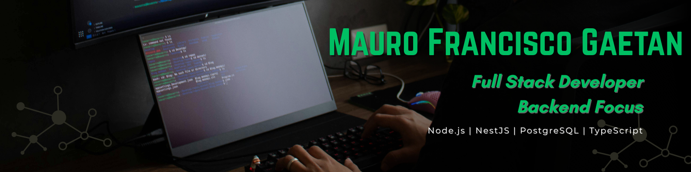

👨‍💻 Backend Developer especializado en Node.js y NestJS
🚀 Construyendo APIs escalables y seguras

🚀 Node.js | NestJS | TypeScript | PostgreSQL

---

## 👨‍💻 Sobre mí

Soy desarrollador Full Stack con especialización en backend utilizando **Node.js y NestJS**.  
Tengo experiencia construyendo **APIs REST seguras, escalables y bien estructuradas**, implementando autenticación con **JWT**, manejo de bases de datos relacionales con **PostgreSQL** y arquitectura modular utilizando **TypeORM**.

He trabajado en proyectos como una **API de e-commerce** y una **plataforma de gestión de gimnasios**, integrando servicios externos, manejo de archivos y documentación de APIs.

También cuento con experiencia trabajando en entornos colaborativos utilizando **Git y metodologías ágiles como Scrum**.

---

# 🛠 Tecnologías y herramientas

### Backend

REST APIs • JWT • Guards • Middleware • CORS

---

### Base de datos

SQL • Relaciones entre entidades

---

### Integraciones

Gestión de imágenes • Documentación de APIs • Manejo de archivos • Variables de entorno (.env)

---

### Herramientas

---

# 🚀 Proyectos principales

### 🛒 E-commerce API

API backend de comercio electrónico desarrollada con **Node.js y NestJS** para la gestión de usuarios, productos y órdenes.

Tecnologías utilizadas:

Node.js • NestJS • PostgreSQL • TypeORM • JWT • Swagger • Cloudinary

---

### 🏋️ PowerGym

Plataforma backend para gestión de gimnasios con autenticación de usuarios y manejo de membresías.

Tecnologías utilizadas:

Node.js • NestJS • PostgreSQL • TypeORM • JWT

---

# 📫 Contacto

💼 LinkedIn  
https://www.linkedin.com/in/maurogaetandev

💻 GitHub  
https://github.com/MauroGaetan

📧 Email  
maurogaetan.dev@gmail.com
